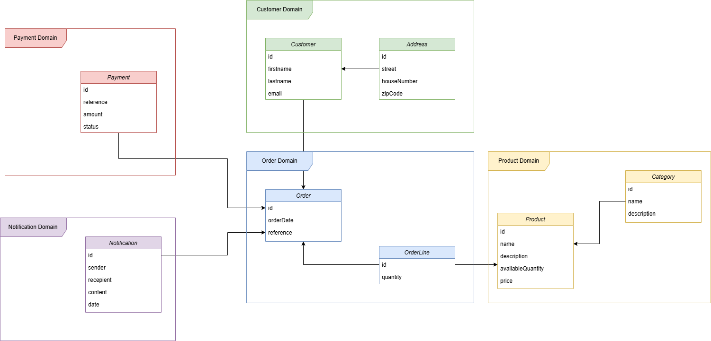
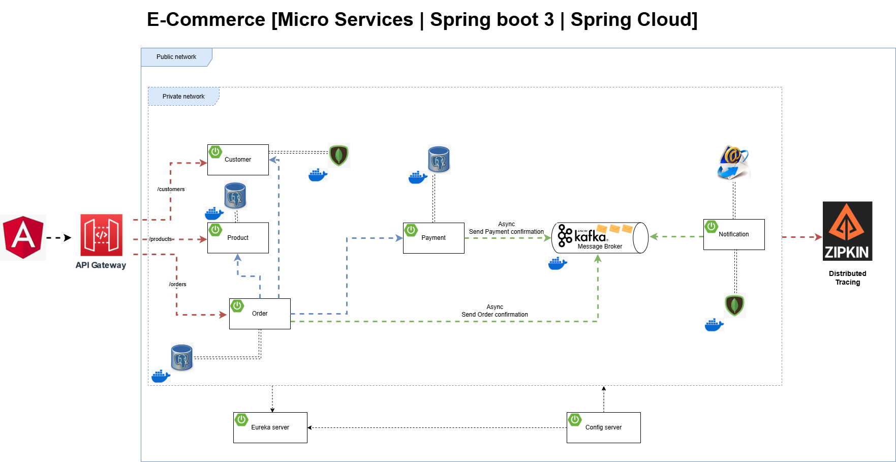
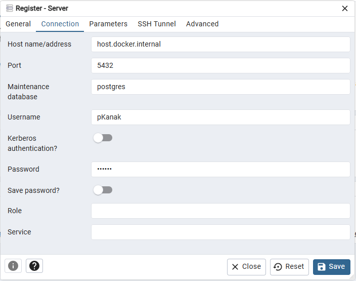
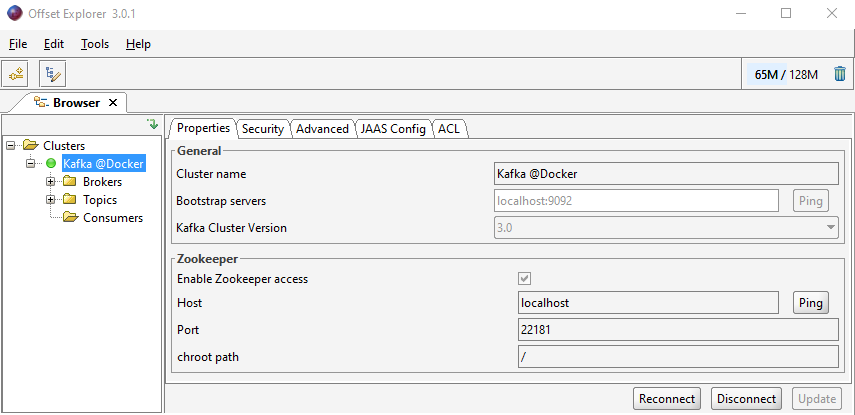
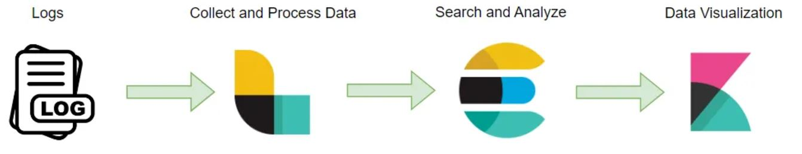

# Application

Implementation of e-commerce application based on: https://www.youtube.com/watch?v=jdeSV0GRvwI&t=966s

## Used technologies
- Java 21 
- Spring Boot 
- Docker 
- MongoDB 
- Kafka  

## Domain definition


## Architecture


- Each microservice must have one database
  (product, order and payment). But for test purpose it will be in one database.
  **But for production divide it into 3 databases**.

## Connection to services

### PG Admin
**PG Admin link**: http://localhost:5050 \
**PG Admin password**: pKanak \
**DB User**: pKanak \
**DB Password**: pKanak

Connection information: \


### Kafka
For correctly running Kafka, you must set `dockervm` variable
in `hosts` file located for Windows on `C:\Windows\System32\drivers\etc`.
Value of `dockervm` must be same like `host.docker.internal`

```
[host.docker.internal.value] dockervm
```

For inspecting Kafka. We can use **Offset Explorer tool**. \
You can download this application here: https://www.kafkatool.com/download.html \
To connect to kafka with zookeeper set these configurations:



### Mongo express

**Mongo express**: http://localhost:8081

Basic authentication \
**Username**: pKanak \
**Password**: pKanak

### Discovery-server

**DS**: http://localhost:8761

### Mail-server

**MS**: http://localhost:1080

### ELK-stack
Based on: https://medium.com/@sovisrushain/monitoring-spring-boot-microservices-logs-with-the-elk-stack-aeeaf3e98d7b



 - **Elasticsearch:** A distributed, RESTful search and analytics engine 
that stores and indexes log data, making it searchable.
 - **Logstash:** A data processing pipeline that ingests, transforms, and forwards 
log data from various sources to Elasticsearch.
 - **Kibana:** A visualization and exploration tool that provides a web-based interface to search, 
view, and analyze logs stored in Elasticsearch.

**Kibana:** http://localhost:5601/ \
**Logstash:** http://localhost:5044/ \
**Elastic-search:** http://localhost:9200/

**Elasticsearch simple queries**
message: "/api/v1/orders" \
message: "/api" and message: "purchase" \
traceId : % 67755d41d40a1442d149d74e84ad312e % \
traceId : % 67755d41d40a1442d149d74e84ad312e % and message: % /api/v1/orders %


### Grafana with Prometheus
Based on: https://medium.com/simform-engineering/revolutionize-monitoring-empowering-spring-boot-applications-with-prometheus-and-grafana-e99c5c7248cf

**Product service** prometheus endpoint: http://localhost:8050/actuator/prometheus \
**Order service** prometheus endpoint: http://localhost:8070/actuator/prometheus

**Prometheus**: http://localhost:9090 \
**Grafana**: http://localhost:3000

First time to log Grafana. Use Username: admin and Password: admin. And set new credentials.

Username: pKanak \
Password: pKanak

Import **Spring boot template dashboard** with id: **11378**
http://localhost:3000/d/spring_boot_21/spring-boot-2-1-system-monitor

### Actuator
for order-ms: http://localhost:8070/actuator/health

### Zipkin
zipkin-ms: http://localhost:9411

### Keycloak
KC: http://localhost:9099 \
Username: pKanak \
Password: pKanak

- create realm **micro-services**
- create client **micro-services-client**

With this setup we will authorize against gateway with **client-id** and **client-secret**

**Setup postman:**
- Authorization: OAuth 2.0
- Grant type `Client Credentials`
- Access Token URL: http://host.docker.internal:9099/realms/micro-services/protocol/openid-connect/token
- Client ID `micro-services-client`
- Client Secret `[value_from_keycloak]`
- Client Authentication `Send as Basic Auth header`
- Get access token with button `Get New Access Token`
- Click on `Proceed` button and click on button `Use Token`
- Now up under combo `Token Name`. Token value appear

### Docker

hosts file position on windows: `C:\Windows\System32\drivers\etc`.
In file important key is: `host.docker.internal`

To increase RAM, which docker use on windows create/edit file
named `.wslconfig` in your user profile directory `C:\Users\<YourUsername>`. Basic
file structure:
```
[wsl2]
memory=10GB
processors=16
```

ms-config-server: **docker build -t ms-config-server .** \
ms-discovery-server: **docker build -t ms-discovery-server .** \
ms-gateway-service: **docker build -t ms-gateway-service .** \
ms-product-service: **docker build -t ms-product-service .** \
ms-notification-service: **docker build -t ms-notification-service .** \
ms-order-service: **docker build -t ms-order-service .** \
ms-payment-service: **docker build -t ms-payment-service .** \
ms-customer-service: **docker build -t ms-customer-service .**